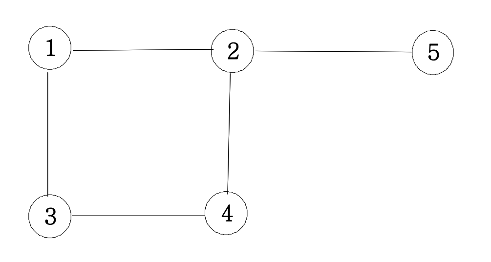
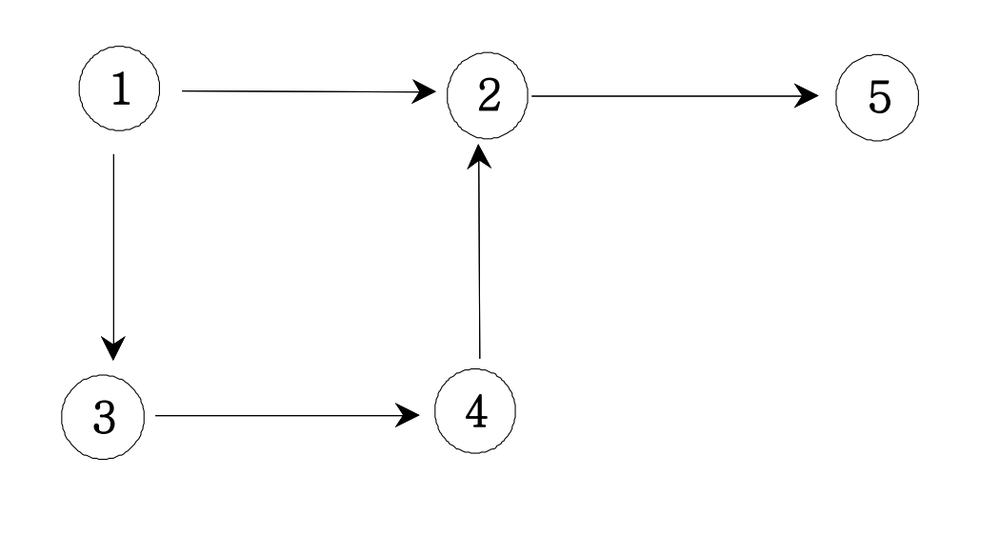
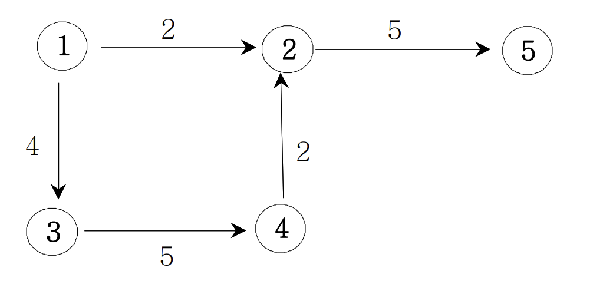

# 그래프와 인접행렬

그래프는 기호로 `G(V, E)`로 나타내며 G:그래프 V:노드, 정점, E:간선을 의미한다. 따라서 그래프는 **정점과 간선으로 이루어진 집합**을 의미한다.

## 무방향 그래프

무방향 그래프는 정점들이 단순히 연결되어 있다는 것만 의미한다. 정점들을 도시라고 생각하면, 각 도시들이 도로로 연결되어 있다고 생각할 수 있다.

<pre>
<code>
  1 2 // 1~2번 정정 간 간선을 의미
  1 3 // 1~3번 정점 간 간선을 의미
  2 4 // ...
  3 4
  2 5
</code>
</pre>

위와 같은 간선 정보가 있다고 가정하면, 아래의 코드를 통해 간선 정보를 2차원 배열(인접 행렬)에 대입할 수 있다.

<pre>
<code>
  graph[a][b] = 1; //a정점과 b정점이 연결되어 있음.
  graph[b][a] = 1; //b정점과 a정점이 연결되어 있음.
</code>
</pre>

모든 간선 정보를 입력하면 아래와 같이 표현된다.

| 인덱스 |  1  |  2  |  3  | 4   | 5   |
| :----: | :-: | :-: | :-: | --- | --- |
| **1**  |  0  |  1  |  1  | 0   | 0   |
| **2**  |  1  |  0  |  0  | 1   | 1   |
| **3**  |  1  |  0  |  0  | 1   | 0   |
| **4**  |  0  |  1  |  1  | 0   | 0   |
| **5**  |  0  |  1  |  0  | 0   | 0   |

이제 완성된 인접 행렬을 보고서 그래프의 형태를 파악할 수 있다.

## 방향 그래프

방향 그래프는 이동하는 방향이 정해진 그래프이다.

위 그래프의 간선 정보를 입력받으면 아래와 같다.

<pre>
<code>
  1 2 // 1->2번 정정 간 간선을 의미
  1 3 // 1->3번 정점 간 간선을 의미
  2 4 // ...
  3 4
  2 5
</code>
</pre>

위 방향 그래프를 인접 행렬로 표현하면 아래와 같다.

| 인덱스 |  1  |  2  |  3  | 4   | 5   |
| :----: | :-: | :-: | :-: | --- | --- |
| **1**  |  0  |  1  |  1  | 0   | 0   |
| **2**  |  0  |  0  |  0  | 0   | 1   |
| **3**  |  0  |  0  |  0  | 1   | 0   |
| **4**  |  0  |  1  |  0  | 0   | 0   |
| **5**  |  0  |  0  |  0  | 0   | 0   |

이제 이 인접 행렬에서 행->열 방향으로 이동할 수 있음을 의미한다.

## 가중치 방향 그래프

가중치는 해당 간선을 이용할 때 필요한 비용을 의미한다.

아래 가중치 방향 그래프를 인접 행렬로 표현해보면 아래와 같다.

| 인덱스 |  1  |  2  |  3  | 4   | 5   |
| :----: | :-: | :-: | :-: | --- | --- |
| **1**  |  0  |  2  |  4  | 0   | 0   |
| **2**  |  0  |  0  |  0  | 0   | 5   |
| **3**  |  0  |  0  |  0  | 5   | 0   |
| **4**  |  0  |  2  |  0  | 0   | 0   |
| **5**  |  0  |  0  |  0  | 0   | 0   |

위 인접 행렬을 통해서 행->열 방향 간선에서 얼마의 비용이 필요한지 알 수 있다.
